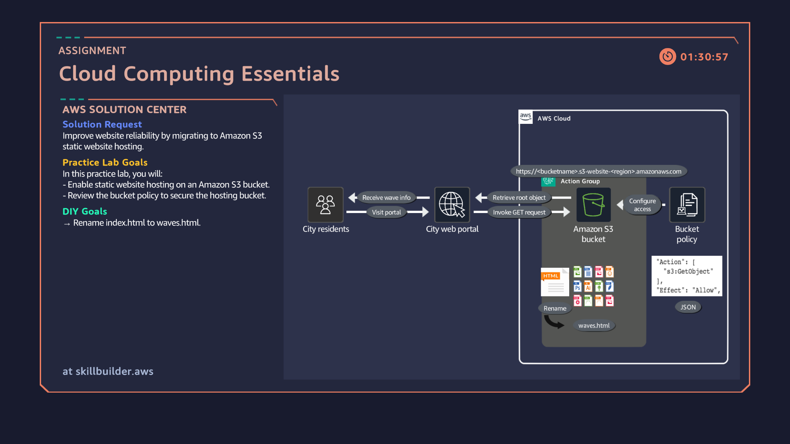

# 01: Hosting a Resilient Static Website on Amazon S3

## Overview
Demonstrating high-availability static web hosting on Amazon S3 without requiring traditional web server infrastructure.

## Architecture Diagram


## Key Implementation Steps
1. Configured an S3 bucket for Static Website Hosting.
2. Updated bucket permissions and applied a public read JSON policy:
```json
{
  "Version": "2012-10-17",
  "Statement": [
    {
      "Sid": "PublicReadGetObject",
      "Effect": "Allow",
      "Principal": "*",
      "Action": "s3:GetObject",
      "Resource": "arn:aws:s3:::YOUR-BUCKET-NAME/*"
    }
  ]
}
