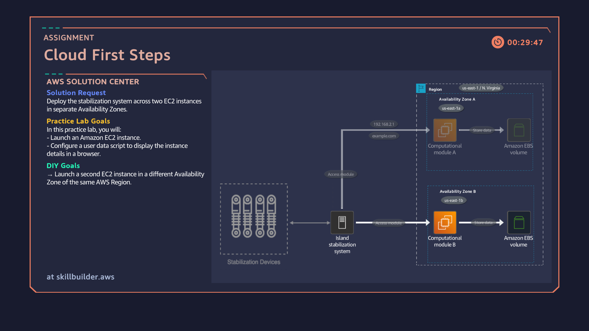

# 02: Deploying Multi-AZ EC2 Instances for High Availability

## Overview
Configuring and deploying virtual compute instances (Amazon EC2) across separate Availability Zones (`us-east-1a` and `us-east-1b`) within the N. Virginia (`us-east-1`) Region to achieve system fault tolerance and high availability.

## Architecture Diagram

## Key Implementation Steps
1. Launched an initial Amazon EC2 instance (`webserver01`) in **AZ 1** (`us-east-1a`).
2. Created and attached an Inbound Security Group (`Lab-SG`) opening Port 80 for public HTTP web accessibility.
3. Used EC2 User Data scripts to initialize web server operations upon system boot.
4. Expanded regional resilience by launching a second EC2 instance (`webserver02`) in **AZ 2** (`us-east-1b`).
5. Validated instance reachability and verified multi-AZ placement across both nodes.

## Verification & Proof

