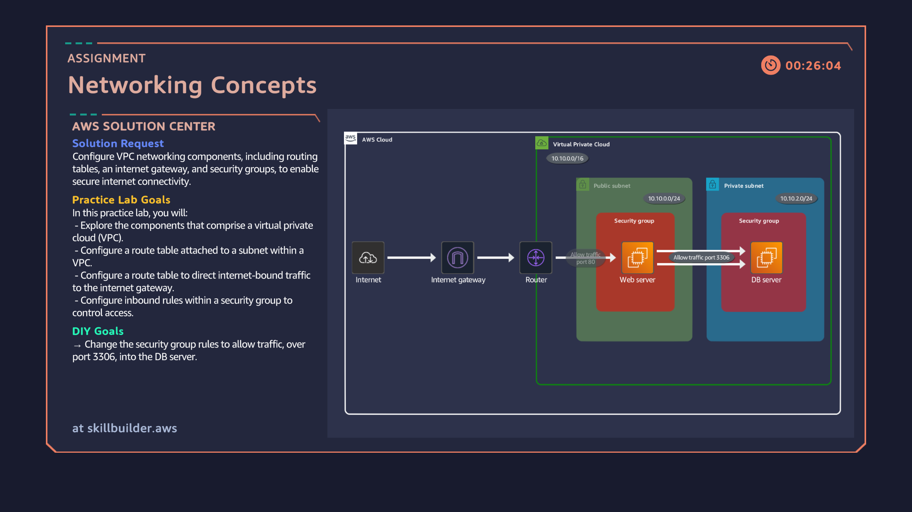

# 04: VPC Networking Concepts & Database Security Group Referencing

## Overview
Configuring multi-tier network security within an Amazon VPC by isolating a backend MySQL database server in a private subnet and granting ingress access exclusively to the public-facing Web Server's Security Group on Port 3306.

## Architecture Diagram

## Key Implementation Steps
1. Analyzed VPC topology featuring public (`10.10.0.0/24`) and private (`10.10.2.0/24`) subnets along with attached Internet Gateways and Route Tables.
2. Verified backend network connectivity boundaries between the application layer and database tier.
3. Updated ingress firewall rules for `DbServerSecurityGroup` to restrict incoming MySQL/Aurora traffic (TCP Port 3306) specifically to `WebServerSecurityGroup`.
4. Applied the Principle of Least Privilege by referencing Security Group IDs directly instead of exposing broad CIDR IP ranges.
5. Confirmed end-to-end database connectivity via the public web server dashboard.
