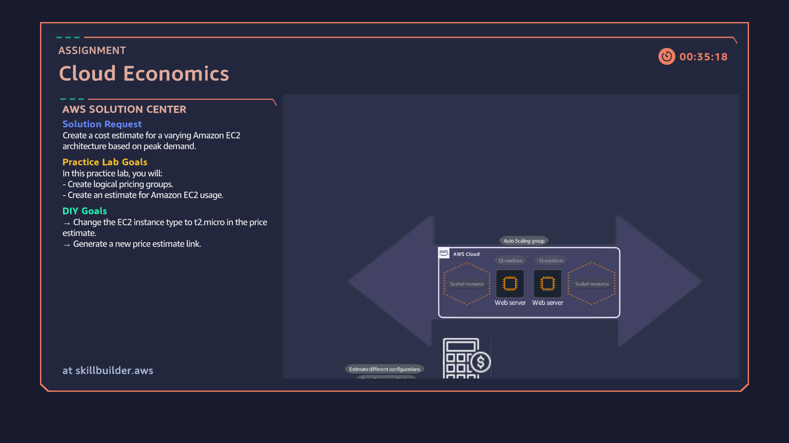

# 05: Cloud Economics & AWS Pricing Calculator Rightsizing

## Overview
Estimating, modeling, and optimizing cloud compute infrastructure costs using the AWS Pricing Calculator. This lab focuses on analyzing variable traffic usage patterns (spikes vs. baseline demand) and rightsizing Amazon EC2 instance families to optimize overall cloud spend.

## Architecture Diagram

## Key Implementation Steps
1. Modeled dynamic traffic patterns using variable workload options (Daily Spike traffic with baseline and peak instance thresholds).
2. Selected target EC2 specifications based on vCPU, RAM, and OS requirements.
3. Added Amazon EBS (gp3) persistent storage options to complete the total compute cost baseline.
4. Performed instance rightsizing by switching instance families from `t3` to `t2.micro` to lower total cost of ownership (TCO).
5. Generated and shared public AWS Pricing Calculator estimates for architectural cost reviews.
