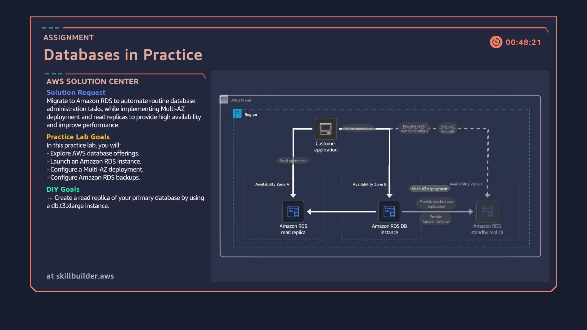

# 06: Amazon RDS Multi-AZ Deployment & Read Replica Scaling

## Overview
Deploying a managed relational database infrastructure using Amazon RDS (MariaDB/MySQL). This lab demonstrates configuring high availability across multiple Availability Zones using Multi-AZ deployments, managing automated snapshots, and scaling read-heavy application workloads by provisioning a dedicated Read Replica.

## Architecture Diagram

## Key Implementation Steps
1. Provisioned a managed Amazon RDS database instance configured with automated backup retention windows.
2. Implemented Multi-AZ deployment topology to maintain a synchronous standby replica in a secondary Availability Zone for automatic failover and high availability.
3. Created an asynchronous Read Replica (`db.t3.xlarge`) offloading read operations from the primary database instance to optimize query performance.
4. Validated network routing and connection boundaries between application clients and database instances across distinct Availability Zones.
