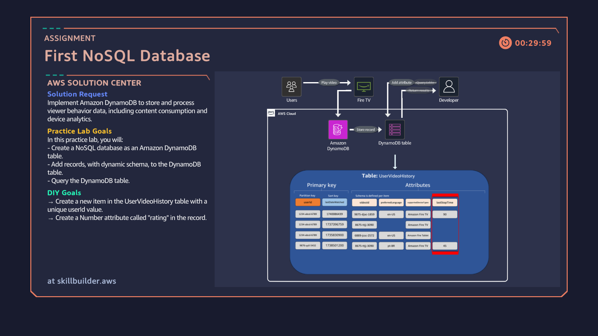

# 07: First NoSQL Database with Amazon DynamoDB

## Overview
Designing and implementing a serverless NoSQL database using Amazon DynamoDB to track and query user video watch history and device telemetry with high speed and flexible schema attributes.

## Architecture Diagram

## Key Implementation Steps
1. Provisioned a DynamoDB table named `UserVideoHistory` using a composite primary key structure: `userId` (Partition Key) and `lastDateWatched` (Sort Key).
2. Leveraged NoSQL schemaless flexibility to store dynamic attributes per item, including `videoId`, `preferredLanguage`, `supportedDeviceTypes` (List), and `lastStopTime`.
3. Created unique database items with custom attributes, including a numeric `rating` field to capture user feedback.
4. Performed targeted database queries using primary keys and comparison operators (`Greater than`) on Unix timestamps to retrieve specific viewer history efficiently.
