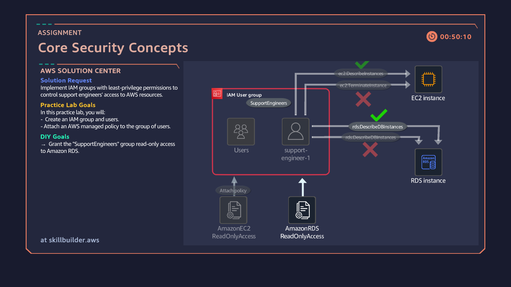

# 09: Identity and Access Management (IAM) Core Security Concepts

## Overview
Implementing Principle of Least Privilege access controls within AWS Identity and Access Management (IAM) by managing user identities, IAM User Groups, and managed permissions policies for operational support teams.

## Architecture Diagram

## Key Implementation Steps
1. Created an IAM User Group named `SupportEngineers` to aggregate access controls for tier-1 infrastructure personnel.
2. Provisioned an individual IAM user (`support-engineer-1`) and mapped the user account directly into the `SupportEngineers` IAM group.
3. Implemented fine-grained Least Privilege authorization by attaching AWS-managed policies `AmazonEC2ReadOnlyAccess` and `AmazonRDSReadOnlyAccess` to the group.
4. Verified role-based access management (RBAC), ensuring members inherits standardized read-only visibility across compute and relational database resources without over-provisioning administrative privileges.
