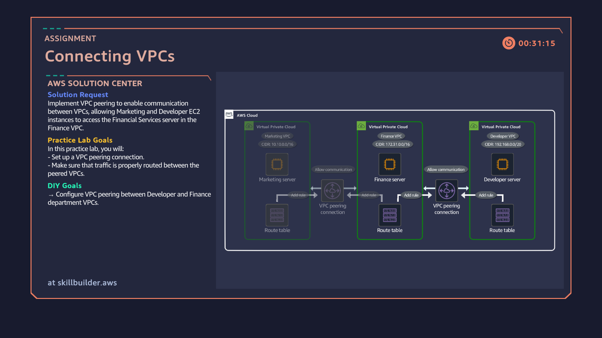

# 11: Connecting VPCs via VPC Peering

## Overview
Establishing secure, private network connectivity between isolated departmental virtual private clouds utilizing AWS VPC Peering Connections and custom route table updates.

## Architecture Diagram

## Key Implementation Steps
1. Created non-overlapping VPC Peering Connections linking isolated Developer, Finance, and Marketing VPCs[cite: 39].
2. Accepted inbound cross-VPC peering connection requests to authorize bidirectional traffic flow[cite: 39].
3. Updated custom route tables across department subnets with explicit peering targets to enable private communication[cite: 39].
4. Verified end-to-end private IP connectivity across peered boundaries without exposure to the public Internet[cite: 39].
