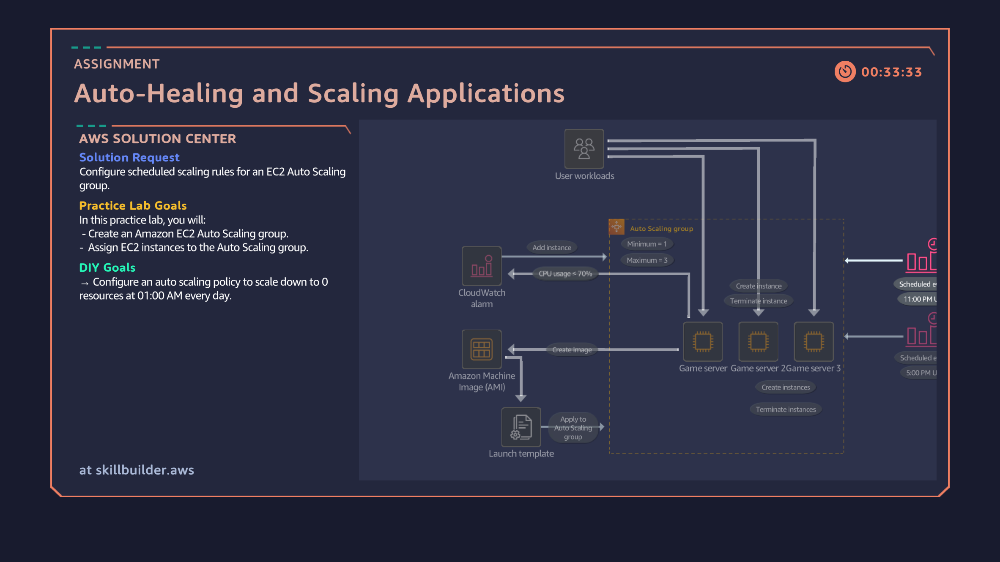

# 10: Auto-Healing and Scaling Applications

## Overview
Configuring automated resource scaling, scheduled scaling policies, and fault-tolerant instance recovery using Amazon EC2 Auto Scaling groups and launch templates.

## Architecture Diagram

## Key Implementation Steps
1. Created and configured a Launch Template defining instance types, security groups, and user data bootstrap scripts.
2. Provisioned an Amazon EC2 Auto Scaling group spanning target subnets with defined Minimum, Maximum, and Desired capacity limits[cite: 38].
3. Integrated CloudWatch metric alarms to trigger scaling actions based on CPU utilization thresholds[cite: 38].
4. Configured scheduled scaling rules to adjust instance capacity dynamically according to predicted application workloads[cite: 38].
